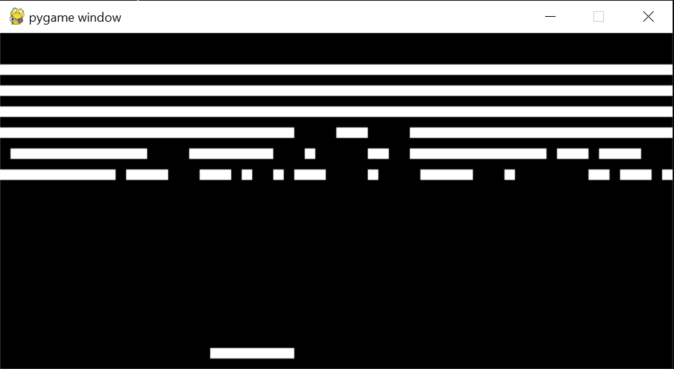

Chip-8
------

This project is a simple Chip-8 emulator written in Python 3. The emulator can be run
by installing the latest version of Python, cloning/downloading the repository folder,
and running `python main.py <file>.rom`. A selection of common Chip-8 games can be
found under the `chip8/roms` folder, including the game in the screenshot above,
breakout.

Currently, only the basic Chip-8 instruction set is supported, no extended sets. Althoug
plans to add support for more instructios are planned for future improvements.

Bug reports are welcome! Feel free to open a new issue under the issue tracker if the bug
you're encountering hasn't been already documented.